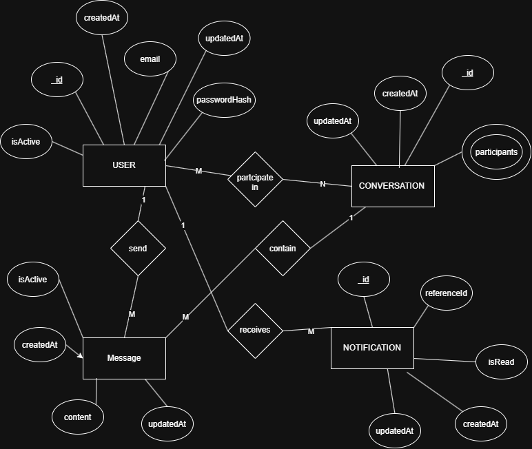

# Linksy — High-Level Database Design

## Overview

Linksy uses **MongoDB** for persistent application data and **Redis** for temporary real-time data such as presence and session-related information.

This high-level design identifies the main entities and their relationships. Detailed fields, indexes, constraints, and schema decisions will be refined during the relevant sprints.

## ER Diagram

## Main Entities

| Entity           | Description                                             |
| ---------------- | ------------------------------------------------------- |
| **User**         | Stores user account and profile information.            |
| **Conversation** | Represents a private 1-to-1 conversation between users. |
| **Message**      | Stores messages sent within conversations.              |
| **Notification** | Stores notifications received by users.                 |

## Main Relationships

| Relationship           | Cardinality | Description                                                                        |
| ---------------------- | ----------- | ---------------------------------------------------------------------------------- |
| User → Conversation    | M:N         | A user can participate in multiple conversations. Each conversation has two users. |
| User → Message         | 1:N         | A user can send many messages. Each message has one sender.                        |
| Conversation → Message | 1:N         | A conversation contains many messages. Each message belongs to one conversation.   |
| User → Notification    | 1:N         | A user can receive many notifications. Each notification belongs to one user.      |

## Redis

Redis will be used for temporary and real-time data, including:

- Online/offline presence
- Last-seen information
- Socket/session data
- Temporary real-time state
- Caching where required

## Design Approach

The high-level model is defined before development begins. Detailed database designs will be created and refined during each sprint as features are implemented.
