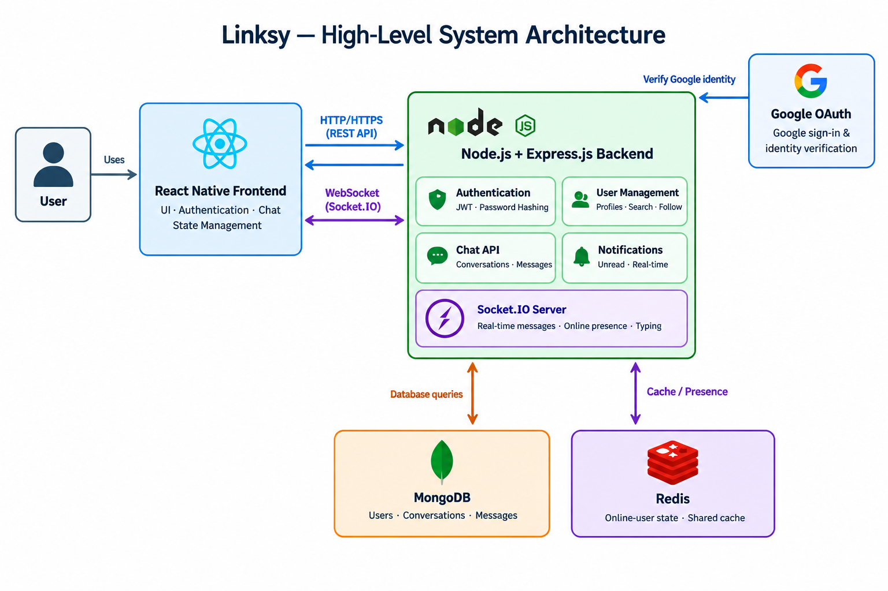

# Linksy — System Architecture

## 1. Overview

Linksy is a real-time messaging application that allows users
to communicate with each other.

The system uses a frontend application, a Node.js backend,
MongoDB for persistent data storage, and Redis for shared
online-presence state.

## 2. High-Level Architecture

## 3. Technology Stack

| Component               | Technology          | Responsibility                           |
| ----------------------- | ------------------- | ---------------------------------------- |
| Frontend                | React Native        | User interface                           |
| Backend                 | Node.js, Express.js | REST APIs and business logic             |
| Real-time communication | Socket.IO           | Real-time messaging                      |
| Database                | MongoDB             | Store users, conversations and messages  |
| Cache / Presence        | Redis               | Online-user state and shared cache       |
| Authentication          | JWT, Google OAuth   | Authentication and identity verification |

## 4. Component Responsibilities

### Frontend

- Display the user interface.
- Send HTTP requests to the backend.
- Establish Socket.IO connections for real-time communication.
- Manage client-side application state.

### Backend

- Validate requests and authenticate users.
- Enforce authorization rules.
- Handle user and conversation management.
- Process and persist messages.
- Manage real-time messaging events.

### MongoDB

- Store user information.
- Store conversations and their participants.
- Store messages and their conversation references.

### Redis

- Maintain shared online-user state.
- Support fast access to temporary data where needed.

### Google OAuth

- Authenticate users through Google when Google sign-in is enabled.

## 5. Communication

- Frontend to backend: HTTP/HTTPS REST API.
- Frontend to Socket.IO server: WebSocket connection,
  with HTTP long-polling fallback when needed.
- Backend to MongoDB: Database operations.
- Backend to Redis: Cache and presence operations.
- Backend to Google OAuth: Google identity verification flow.

## 6. Security

- Hash passwords before storing them.
- Validate and authorize API requests.
- Verify Socket.IO connections.
- Check conversation membership before allowing access
  to messages.
- Protect secrets using environment variables.

## 7. Deployment

Deployment details will be documented when the hosting
environment and production configuration are finalized.
